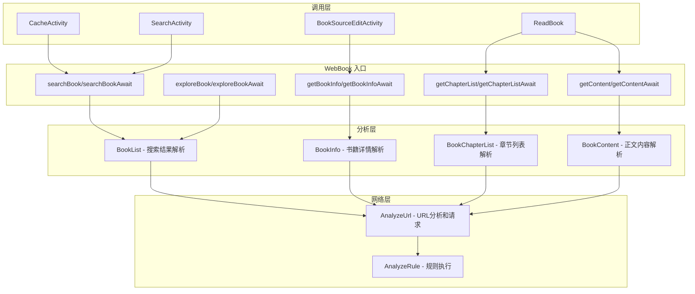

# 书源网络请求（WebBook）详解

主要内容 ：

- 六大核心方法： searchBook 、 exploreBook 、 getBookInfo 、 getChapterList 、 getContent 、 preciseSearch
- 异步回调 vs 挂起函数两种调用方式
- 登录检测 JS 机制
- 重定向检测
- 分析层组件（BookList/BookInfo/BookChapterList/BookContent）
- 协程上下文传递
- 与 CacheBook 的协作

## 概述

`WebBook` 是一个 **object（单例）**，是**书源网络请求的核心入口**。它封装了所有与书源相关的网络操作，提供：
- 搜索书籍
- 发现书籍
- 获取书籍详情
- 获取章节目录
- 获取章节正文
- 精准搜索

所有请求都支持登录检测 JS 脚本执行、重定向检测、协程上下文切换。

---

## 核心架构



---

## 核心数据结构

### 1. 书源

```kotlin
data class BookSource(
    val bookSourceUrl: String,      // 书源基础 URL
    val bookSourceName: String,    // 书源名称
    val bookSourceGroup: String,   // 书源分组
    val searchUrl: String?,        // 搜索 URL 规则
    val ruleToc: RuleToc?,         // 目录规则
    val ruleContent: RuleContent?, // 正文规则
    val loginCheckJs: String?,     // 登录检测 JS
    // ...
)
```

### 2. 书籍

```kotlin
data class Book(
    val bookUrl: String,           // 书籍 URL（详情页）
    val name: String,             // 书名
    val author: String,           // 作者
    val origin: String,           // 书源标识
    val tocUrl: String?,          // 目录页 URL
    val coverUrl: String?,        // 封面 URL
    val intro: String?,           // 简介
    val totalChapterNum: Int,     // 总章节数
    val durChapterIndex: Int,    // 当前阅读章节索引
    // ...
)
```

### 3. 章节

```kotlin
data class BookChapter(
    val bookUrl: String,          // 所属书籍 URL
    val url: String,             // 章节 URL
    val title: String,           // 章节标题
    val index: Int,             // 章节索引
    val isVip: Boolean,         // 是否 VIP
    val isVolume: Boolean,       // 是否卷名
    // ...
)
```

---

## 主要方法详解

### 1. 搜索书籍

#### 异步回调方式

```kotlin
fun searchBook(
    scope: CoroutineScope,
    bookSource: BookSource,
    key: String,
    page: Int? = 1,
    context: CoroutineContext = Dispatchers.IO,
    start: CoroutineStart = CoroutineStart.DEFAULT,
    executeContext: CoroutineContext = Dispatchers.Main,
): Coroutine<ArrayList<SearchBook>> {
    return Coroutine.async(scope, context, start = start, executeContext = executeContext) {
        searchBookAwait(bookSource, key, page)
    }
}
```

#### 挂起函数方式

```kotlin
suspend fun searchBookAwait(
    bookSource: BookSource,
    key: String,
    page: Int? = 1,
    filter: ((name: String, author: String, kind: String?) -> Boolean)? = null,
    shouldBreak: ((size: Int) -> Boolean)? = null
): ArrayList<SearchBook> {
    // 1. 构建请求 URL
    val analyzeUrl = AnalyzeUrl(
        mUrl = searchUrl,
        key = key,
        page = page,
        baseUrl = bookSource.bookSourceUrl,
        source = bookSource,
        coroutineContext = currentCoroutineContext()
    )

    // 2. 发送请求
    val checkJs = bookSource.loginCheckJs
    val res = kotlin.runCatching {
        analyzeUrl.getStrResponseAwait().let {
            if (!checkJs.isNullOrBlank()) {
                // 检测书源是否已登录
                analyzeUrl.evalJS(checkJs, it) as StrResponse
            } else {
                it
            }
        }
    }.getOrElse { /* 错误处理 */ }

    // 3. 检测重定向
    checkRedirect(bookSource, res)

    // 4. 解析搜索结果
    return BookList.analyzeBookList(
        bookSource = bookSource,
        analyzeUrl = analyzeUrl,
        baseUrl = res.url,
        body = res.body,
        isSearch = true,
        isRedirect = res.raw.priorResponse?.isRedirect == true,
        filter = filter,
        shouldBreak = shouldBreak
    )
}
```

**搜索流程图解**：

```
用户输入: "斗破苍穹"
         │
         ▼
┌─────────────────────────────────────────────────────────┐
│                   searchBookAwait                        │
│                                                         │
│  1. AnalyzeUrl 构建搜索 URL                               │
│     searchUrl = "https://example.com/search?q={key}"    │
│     key = "斗破苍穹"                                     │
│                                                         │
│  2. HTTP 请求 + 登录检测                                 │
│     getStrResponseAwait()                               │
│     evalJS(loginCheckJs, response)                       │
│                                                         │
│  3. 检测重定向                                           │
│     checkRedirect()                                      │
│                                                         │
│  4. 解析搜索结果                                          │
│     BookList.analyzeBookList()                          │
└────────────────────────────┬────────────────────────────┘
                             │
                             ▼
                    ArrayList<SearchBook>
```

### 2. 发现书籍

```kotlin
suspend fun exploreBookAwait(
    bookSource: BookSource,
    url: String,
    page: Int? = 1,
): ArrayList<SearchBook> {
    val ruleData = RuleData()
    val sourceUrl = bookSource.bookSourceUrl

    // 获取探索信息
    val exploreInfoMap = exploreInfoMapList[sourceUrl]

    val analyzeUrl = AnalyzeUrl(
        mUrl = url,
        page = page,
        baseUrl = sourceUrl,
        source = bookSource,
        ruleData = ruleData,
        coroutineContext = currentCoroutineContext(),
        infoMap = exploreInfoMap
    )

    // 与搜索相同的请求和解析逻辑
    val checkJs = bookSource.loginCheckJs
    val res = kotlin.runCatching {
        analyzeUrl.getStrResponseAwait().let {
            if (!checkJs.isNullOrBlank()) {
                analyzeUrl.evalJS(checkJs, it) as StrResponse
            } else {
                it
            }
        }
    }.getOrElse { /* ... */ }

    checkRedirect(bookSource, res)

    return BookList.analyzeBookList(
        bookSource = bookSource,
        ruleData = ruleData,
        analyzeUrl = analyzeUrl,
        baseUrl = res.url,
        body = res.body,
        isSearch = false
    )
}
```

**发现 vs 搜索**：
- **搜索**：用户输入关键词，从书源的搜索页获取结果
- **发现**：书源预设的分类 URL，直接获取书籍列表

### 3. 获取书籍详情

```kotlin
suspend fun getBookInfoAwait(
    bookSource: BookSource,
    book: Book,
    canReName: Boolean = true,
): Book {
    book.removeAllBookType()
    book.addType(bookSource.getBookType())

    if (!book.infoHtml.isNullOrEmpty()) {
        // 直接使用已有的 HTML 内容解析
        BookInfo.analyzeBookInfo(
            bookSource = bookSource,
            book = book,
            baseUrl = book.bookUrl,
            redirectUrl = book.bookUrl,
            body = book.infoHtml,
            canReName = canReName
        )
    } else {
        // 请求详情页
        val analyzeUrl = AnalyzeUrl(
            mUrl = book.bookUrl,
            baseUrl = bookSource.bookSourceUrl,
            source = bookSource,
            ruleData = book,
            coroutineContext = currentCoroutineContext()
        )

        val checkJs = bookSource.loginCheckJs
        val res = kotlin.runCatching {
            analyzeUrl.getStrResponseAwait().let {
                if (!checkJs.isNullOrBlank()) {
                    analyzeUrl.evalJS(checkJs, it) as StrResponse
                } else {
                    it
                }
            }
        }.getOrElse { /* ... */ }

        checkRedirect(bookSource, res)

        BookInfo.analyzeBookInfo(
            bookSource = bookSource,
            book = book,
            baseUrl = book.bookUrl,
            redirectUrl = res.url,
            body = res.body,
            canReName = canReName
        )
    }

    return book
}
```

**解析内容**：
- 书名、作者
- 封面图片
- 简介
- 分类/标签
- 字数
- 最新章节
- 目录页 URL

### 4. 获取章节目录

```kotlin
suspend fun getChapterListAwait(
    bookSource: BookSource,
    book: Book,
    runPerJs: Boolean = false,
    isFromBookInfo: Boolean = false
): Result<List<BookChapter>> {
    book.removeAllBookType()
    book.addType(bookSource.getBookType())

    return kotlin.runCatching {
        // 1. 可选：执行目录前置 JS
        if (runPerJs) {
            runPreUpdateJs(bookSource, book, isFromBookInfo).getOrThrow()
        }

        // 2. 使用已有的目录 HTML 或请求目录页
        if (book.bookUrl == book.tocUrl && !book.tocHtml.isNullOrEmpty()) {
            BookChapterList.analyzeChapterList(
                bookSource = bookSource,
                book = book,
                baseUrl = book.tocUrl,
                redirectUrl = book.tocUrl,
                body = book.tocHtml,
                isFromBookInfo = isFromBookInfo
            )
        } else {
            val analyzeUrl = AnalyzeUrl(
                mUrl = book.tocUrl,
                baseUrl = book.bookUrl,
                source = bookSource,
                ruleData = book,
                coroutineContext = currentCoroutineContext()
            )

            val checkJs = bookSource.loginCheckJs
            val res = kotlin.runCatching {
                analyzeUrl.getStrResponseAwait().let {
                    if (!checkJs.isNullOrBlank()) {
                        analyzeUrl.evalJS(checkJs, it) as StrResponse
                    } else {
                        it
                    }
                }
            }.getOrElse { /* ... */ }

            checkRedirect(bookSource, res)

            BookChapterList.analyzeChapterList(
                bookSource = bookSource,
                book = book,
                baseUrl = book.tocUrl,
                redirectUrl = res.url,
                body = res.body,
                isFromBookInfo = isFromBookInfo
            )
        }
    }.onFailure {
        currentCoroutineContext().ensureActive()
    }
}
```

**目录前置 JS**：

```kotlin
suspend fun runPreUpdateJs(
    bookSource: BookSource,
    book: Book,
    isFromBookInfo: Boolean = false
): Result<Unit> {
    return kotlin.runCatching {
        val preUpdateJs = bookSource.ruleToc?.preUpdateJs
        if (!preUpdateJs.isNullOrBlank()) {
            AnalyzeRule(book, bookSource, true, isFromBookInfo)
                .setCoroutineContext(currentCoroutineContext())
                .evalJS(preUpdateJs)
        }
    }.onFailure {
        AppLog.put("执行preUpdateJs规则失败 书源:${bookSource.bookSourceName}", it)
    }
}
```

### 5. 渐进式目录加载（Flow 方式）

```kotlin
suspend fun getChapterListFlow(
    bookSource: BookSource,
    book: Book,
    runPerJs: Boolean = false,
    isFromBookInfo: Boolean = false
): Flow<PartialChapterList> {
    // 与 getChapterListAwait 类似，但调用 analyzeChapterListFlow
    // 逐页发射目录结果，允许"边加载边进入正文"
}
```

### 6. 获取章节正文

```kotlin
suspend fun getContentAwait(
    bookSource: BookSource,
    book: Book,
    bookChapter: BookChapter,
    nextChapterUrl: String? = null,
    needSave: Boolean = true
): String {
    val contentRule = bookSource.getContentRule()

    // 如果正文规则为空，返回章节 URL
    if (contentRule.content.isNullOrEmpty()) {
        Debug.log(bookSource.bookSourceUrl, "⇒正文规则为空,使用章节链接:${bookChapter.url}")
        return bookChapter.url
    }

    // 一级目录不解析规则
    if (bookChapter.isVolume && bookChapter.url.startsWith(bookChapter.title)) {
        Debug.log(bookSource.bookSourceUrl, "⇒一级目录正文不解析规则")
        return bookChapter.tag ?: ""
    }

    // 使用已有内容或请求正文页
    return if (bookChapter.url == book.bookUrl && !book.tocHtml.isNullOrEmpty()) {
        BookContent.analyzeContent(
            bookSource = bookSource,
            book = book,
            bookChapter = bookChapter,
            baseUrl = bookChapter.getAbsoluteURL(),
            redirectUrl = bookChapter.getAbsoluteURL(),
            body = book.tocHtml,
            nextChapterUrl = nextChapterUrl,
            needSave = needSave
        )
    } else {
        val analyzeUrl = AnalyzeUrl(
            mUrl = bookChapter.getAbsoluteURL(),
            baseUrl = book.tocUrl,
            source = bookSource,
            ruleData = book,
            chapter = bookChapter,
            coroutineContext = currentCoroutineContext()
        )

        val checkJs = bookSource.loginCheckJs
        val res = kotlin.runCatching {
            analyzeUrl.getStrResponseAwait(
                jsStr = contentRule.webJs,
                sourceRegex = contentRule.sourceRegex
            ).let {
                if (!checkJs.isNullOrBlank()) {
                    analyzeUrl.evalJS(checkJs, it) as StrResponse
                } else {
                    it
                }
            }
        }.getOrElse { /* ... */ }

        checkRedirect(bookSource, res)

        BookContent.analyzeContent(
            bookSource = bookSource,
            book = book,
            bookChapter = bookChapter,
            baseUrl = bookChapter.getAbsoluteURL(),
            redirectUrl = res.url,
            body = res.body,
            nextChapterUrl = nextChapterUrl,
            needSave = needSave
        )
    }
}
```

**正文解析流程**：

```
┌─────────────────────────────────────────────────────────┐
│                   getContentAwait                        │
│                                                         │
│  1. 检查正文规则是否为空                                 │
│     contentRule.content.isNullOrEmpty() → 返回URL      │
│                                                         │
│  2. 检查是否一级目录                                     │
│     isVolume && url.startsWith(title) → 返回tag        │
│                                                         │
│  3. 构建请求                                            │
│     AnalyzeUrl(chapter.url, ...)                        │
│                                                         │
│  4. HTTP 请求                                           │
│     getStrResponseAwait(jsStr, sourceRegex)             │
│                                                         │
│  5. 解析正文                                            │
│     BookContent.analyzeContent()                        │
│                                                         │
│  6. 保存到本地（可选）                                   │
│     if (needSave) BookHelp.saveContent()                │
└────────────────────────────┬────────────────────────────┘
                             │
                             ▼
                         String content
```

---

## 精准搜索

```kotlin
suspend fun preciseSearchAwait(
    bookSource: BookSource,
    name: String,
    author: String,
): Result<Book> {
    return kotlin.runCatching {
        currentCoroutineContext().ensureActive()

        // 调用搜索，但使用精确过滤
        searchBookAwait(
            bookSource, name,
            filter = { fName, fAuthor, _ ->
                fName == name && fAuthor == author
            },
            shouldBreak = { it > 0 }  // 找到第一个就停止
        ).firstOrNull()?.toBook()
            ?: throw NoStackTraceException("未搜索到 $name($author) 书籍")
    }
}
```

---

## 重定向检测

```kotlin
private fun checkRedirect(bookSource: BookSource, response: StrResponse) {
    response.raw.priorResponse?.let {
        if (it.isRedirect) {
            Debug.log(bookSource.bookSourceUrl, "≡检测到重定向(${it.code})")
            Debug.log(bookSource.bookSourceUrl, "┌重定向后地址")
            Debug.log(bookSource.bookSourceUrl, "└${response.url}")
        }
    }
}
```

---

## 请求模式

### 异步回调方式

```kotlin
fun searchBook(...): Coroutine<ArrayList<SearchBook>> {
    return Coroutine.async(scope, context, start = start, executeContext = executeContext) {
        searchBookAwait(bookSource, key, page)
    }
}
```

**使用场景**：
- 需要在回调中处理结果
- 兼容旧的代码风格

### 挂起函数方式

```kotlin
suspend fun searchBookAwait(...): ArrayList<SearchBook> {
    // 直接返回结果
}
```

**使用场景**：
- 现代协程代码
- 简洁的同步风格调用

---

## 登录检测机制

```kotlin
val checkJs = bookSource.loginCheckJs
val res = kotlin.runCatching {
    analyzeUrl.getStrResponseAwait().let {
        if (!checkJs.isNullOrBlank()) {
            // 执行登录检测 JS
            analyzeUrl.evalJS(checkJs, it) as StrResponse
        } else {
            it
        }
    }
}.getOrElse { throwable ->
    if (!checkJs.isNullOrBlank()) {
        // 失败时也检测登录状态
        val errResponse = analyzeUrl.getErrStrResponse(throwable)
        try {
            (analyzeUrl.evalJS(checkJs, errResponse) as StrResponse).also {
                if (it.code() == 500) {
                    throw throwable
                }
            }
        } catch (_: Throwable) {
            throw throwable
        }
    } else {
        throw throwable
    }
}
```

**登录检测流程**：

```
正常请求响应
      │
      ▼
┌─────────────────┐
│ loginCheckJs   │──为空──▶ 直接使用响应
│ 不为空          │
└────────┬────────┘
         │
         ▼
┌─────────────────┐
│ evalJS(js, res) │──成功──▶ 返回响应
│                 │
│ 登录成功        │
└────────┬────────┘
         │
         │ 失败（状态码500）
         ▼
┌─────────────────┐
│ evalJS(js, err) │──登录成功──▶ 抛出原异常
│                 │                     
│ 登录失败        │
└─────────────────┘
```

---

## 与 CacheBook 的协作

```kotlin
// CacheBook.kt
WebBook.getContent(
    scope,
    bookSource,
    book,
    chapter,
    context = context,
    start = CoroutineStart.LAZY,
    executeContext = context
).onSuccess { content ->
    onSuccess(chapter)
    downloadFinish(chapter, content)
}.onError {
    onError(chapter, it)
    downloadFinish(chapter, "获取正文失败\n${it.localizedMessage}")
}.onCancel {
    onCancel(chapter.index)
}.onFinally {
    postEvent(EventBus.UP_DOWNLOAD, book.bookUrl)
}.start()
```

---

## 分析层组件

### BookList — 搜索/发现结果解析

解析搜索页 HTML，根据书源规则提取书籍列表：

```kotlin
object BookList {
    fun analyzeBookList(
        bookSource: BookSource,
        ruleData: RuleData,
        analyzeUrl: AnalyzeUrl,
        baseUrl: String,
        body: String,
        isSearch: Boolean,
        isRedirect: Boolean = false,
        filter: ((name: String, author: String, kind: String?) -> Boolean)? = null,
        shouldBreak: ((size: Int) -> Boolean)? = null
    ): ArrayList<SearchBook> {
        // 1. 获取书源规则的搜索列表规则
        val rule = if (isSearch) bookSource.getSearchRule() else bookSource.getExploreRule()
        // 2. 使用 AnalyzeRule 执行规则
        // 3. 返回解析结果
    }
}
```

### BookInfo — 书籍详情解析

```kotlin
object BookInfo {
    fun analyzeBookInfo(
        bookSource: BookSource,
        book: Book,
        baseUrl: String,
        redirectUrl: String,
        body: String,
        canReName: Boolean = true
    ): Book {
        // 1. 获取书源规则的详情规则
        val rule = bookSource.getBookInfoRule()
        // 2. 执行规则，填充 Book 对象
    }
}
```

### BookChapterList — 章节目录解析

```kotlin
object BookChapterList {
    fun analyzeChapterList(
        bookSource: BookSource,
        book: Book,
        baseUrl: String,
        redirectUrl: String,
        body: String,
        isFromBookInfo: Boolean = false
    ): List<BookChapter> {
        // 1. 获取目录规则
        val rule = bookSource.ruleToc
        // 2. 执行规则，提取章节列表
        // 3. 处理多页目录（如果配置了）
        // 4. 去重处理
    }
}
```

### BookContent — 正文内容解析

```kotlin
object BookContent {
    fun analyzeContent(
        bookSource: BookSource,
        book: Book,
        bookChapter: BookChapter,
        baseUrl: String,
        redirectUrl: String,
        body: String,
        nextChapterUrl: String? = null,
        needSave: Boolean = true
    ): String {
        // 1. 获取正文规则
        val contentRule = bookSource.getContentRule()
        // 2. 执行规则，提取正文
        // 3. 应用后处理（去重复、格式化等）
        // 4. 保存到本地（如果 needSave）
    }
}
```

---

## 协程上下文传递

```kotlin
AnalyzeUrl(
    mUrl = searchUrl,
    key = key,
    page = page,
    baseUrl = bookSource.bookSourceUrl,
    source = bookSource,
    ruleData = ruleData,
    coroutineContext = currentCoroutineContext()  // 传递协程上下文
)
```

**好处**：
- 请求可以在正确的协程中执行
- 支持协程取消传播
- 异常处理一致

---

## 常见问题

**Q1: 搜索失败怎么办？**
A: 检查书源的搜索 URL 是否正确，网络是否可达，登录检测 JS 是否有问题。

**Q2: 正文获取为空？**
A: 检查正文规则是否配置正确，章节 URL 是否有效。

**Q3: 如何调试书源规则？**
A: 使用日志功能，查看 `Debug.log()` 输出的解析过程。

**Q4: 请求超时怎么处理？**
A: `AnalyzeUrl` 有默认超时配置，可以在书源中设置超时时间。

**Q5: 如何实现多页正文？**
A: 在正文规则中配置 `nextContentUrl` 或使用 JS 脚本处理分页。
